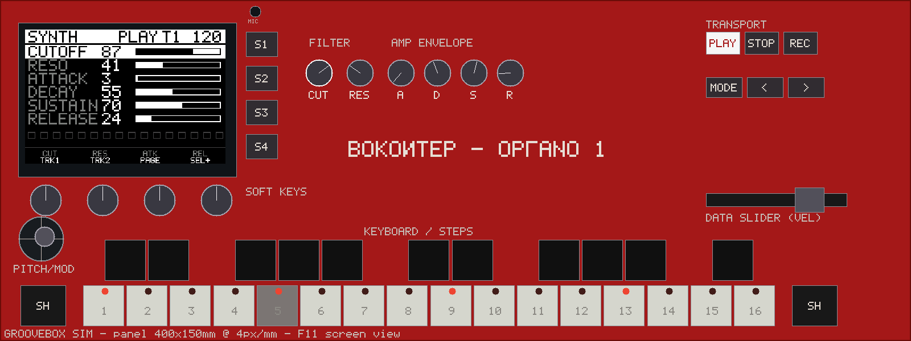

# groovebox — ВОКОИТЕР / ΟΡΓΑΝΟ

A standalone, battery-powered groovebox: a **Raspberry Pi Zero 2W** brain
running the [yawn](https://github.com/tkleisas/yawn) audio engine, with a
**Raspberry Pi Pico** panel module presenting the whole control surface to
the Pi as a plain USB-MIDI device. Screen, step-sequencer LEDs, encoders,
mic — everything else hangs off those two chips.

Design language: Soviet-cosmonaut mission control per
[bokontep.gr](https://www.bokontep.gr) — deep-red faceplate, cream/black
keys, bilingual Greek/Cyrillic UI strings, terminal-green telemetry.



## Two designs, one repo

| | NSR-1 (ΟΡΓΑΝΟ 1) | NSR-2 |
|---|---|---|
| Concept | full-size panel, 400 × 150 mm | compact, 180 × 210 mm faceplate PCB |
| Keys | 27 MX keys (piano row) + 12 function | 45 Choc keys (4×8 grid) + 13 function |
| Control | 4 encoders, 6 pots, data slider, thumbstick | 4 encoders, thumbstick, crossfader |
| Status | design + hardware spec rev A, KiCad skeletons | schematic-complete, **0 ERC errors**, footprints assigned |
| Docs | [`docs/design.md`](docs/design.md) | [`docs/nsr2-design.md`](docs/nsr2-design.md) + [`nsr2/README.md`](nsr2/README.md) |

## What it does (emulator, today)

- **4 tracks** × **1–256 step patterns** (default 16, 16-step paged window).
  Per-step: on/off, velocity (data slider), accent (black keys), pitch and
  gate (hold-step + encoders, synth track).
- **Play mode**: the keyboard row becomes a 2-octave chromatic keyboard,
  velocity from the slider, joystick = pitch bend / mod. REC-arm + play
  records quantized notes into the pattern.
- **Sound**: yawn engine instruments (SubtractiveSynth, DrumRack, FM,
  Wavetable, Granular, …) + one insert FX slot per track (29 effect types).
- **Sampling**: SAMPLE page — record from mic/line-in, trim, normalize,
  assign to a drum pad; LOAD page browses samples.
- **Controls (NSR-1)**: 6 dedicated pots (filter cutoff/resonance + amp ADSR
  — strict one-parameter-one-control rule), 4 pageable encoders with push,
  data slider, 2-axis spring-return thumbstick, transport, MODE, </>,
  4 soft keys, dual SHIFT keys at the keyboard row ends.
- **UI**: Elektron-style monochrome, 3 themes (mono / red / green phosphor),
  ПОЕХАЛИ! boot splash, full widget library (sequencer, mixer, waveform,
  ADSR, FM-algo, spectrum, phase pie, tuner, file browser, virtual keyboard…).
- **Sync/IO**: DIN MIDI in/out, Ableton Link (engine), USB-MIDI on OTG,
  integrated mic + line in for sampling (WM8731 codec).

## Hardware (NSR-1, rev A)

| | |
|---|---|
| Brain | Raspberry Pi Zero 2W (≥5 h battery is a hard requirement) |
| Panel controller | Raspberry Pi Pico — presents as USB-MIDI device `groovebox-panel` |
| Audio codec | Audio Injector Zero (WM8731: stereo out + mic/line in). Bench rig: CJMCU-1334 (UDA1334A, playback only) |
| Display | 4.0" SPI TFT 480×320 (ILI9488); UI rendered at 240×160, 2× integer scale |
| Keys | 39 MX-style switches (Gateron Red / Silent Red), hot-swap sockets, per-key LEDs (whites), 19.05 mm pitch |
| Panel I/O | 3× MCP23017 (39 single-ended keys), HT16K33 (16 LEDs), 3× ADS1115 (6 pots + slider + joystick) |
| Power | LiPo + Adafruit PowerBoost 1000C |
| Panel size | 400×150 mm, deep red |

Full hardware design, GPIO maps and BOM: [docs/design.md](docs/design.md).
Panel/brain protocol (USB-MIDI + SysEx config):
[docs/panel-protocol.md](docs/panel-protocol.md).

## Architecture

```
  Pi Zero 2W (brain)                      Pico (panel module)
  ├ yawn engine (I2S codec)      ◄─USB─►  ├ keys    (3× MCP23017)
  ├ fbdev UI → 480×320 SPI TFT            ├ LEDs    (HT16K33)
  ├ DIN MIDI in/out (UART)                ├ encoders (GPIO)
  └ mic (codec input)                     └ analog  (3× ADS1115)
```

The panel is deliberately dumb — it reports physical events and accepts
routing SysEx; **all musical semantics live in the brain app**. The same
app binary runs on the PC (SDL3 emulator with a geometry-driven,
mouse-interactive virtual front panel) and on the Pi (fbdev + panel over
USB-MIDI) through a HAL, which is how everything is developed before
hardware exists. See [`docs/panel-protocol.md`](docs/panel-protocol.md)
for the wire protocol.

## Building

| Target | How | Needs |
|---|---|---|
| Emulator | CMake in `emulator/` (binary `groovebox_sim`) | MSVC or GCC, SDL3, yawn submodule (`git submodule update --init`) |
| Panel firmware | `panel-fw/build.ps1` or CMake with the Pico SDK (see `panel-fw/README.md`) | Pico SDK + toolchain |
| OS image | Raspberry Pi OS Lite + `os-image/customize/` (first-run script, systemd unit) | a Pi / imager |
| Hardware | KiCad 10; NSR-2 schematics are **generated** — see [`nsr2/README.md`](nsr2/README.md) before touching them | KiCad 10.0+ |

Windows/MSVC emulator build:

```bash
CMAKE="/c/Program Files/Microsoft Visual Studio/2022/Community/Common7/IDE/CommonExtensions/Microsoft/CMake/CMake/bin/cmake.exe"
"$CMAKE" -B emulator/build -S emulator -G "Visual Studio 17 2022" -A x64
"$CMAKE" --build emulator/build --target groovebox_sim --config Debug -- -m
emulator/build/Debug/groovebox_sim.exe            # interactive sim
```

The yawn engine is built lean (VST3 / NAM / Link / 3D / ONNX / video OFF).

### Pi cross-build (arm64, Docker)

`tools/build-pi-arm64.sh` builds `groovebox_sim` for 64-bit Raspberry Pi
OS (bookworm, aarch64) in a Docker container — no Pi needed on the desk:

```bash
tools/build-pi-arm64.sh     # image + cross-build + provenance + qemu smoke
```

The image (`emulator/pi/Dockerfile`) is Debian bookworm with the
`aarch64-linux-gnu` toolchain and the **arm64** `libasound2-dev` (ALSA is
the one target-arch dependency — RtMidi and PortAudio are compiled from
source by yawn's FetchContent but link against the target's ALSA). The
toolchain file is `emulator/pi/aarch64-toolchain.cmake`; CMake is driven
with `-DGB_PI_BACKEND=ON`, which swaps the SDL3 SimBackend for the
headless PiBackend (fbdev + RtMidi) and drops the SDL3 link. The script
finishes by proving the binary (`readelf -h` → `AArch64`) and
smoke-running it under `qemu-aarch64` (the container has no ALSA device
PortAudio accepts, so the engine can't boot there — the qemu run proves
execution + graceful peripheral degradation; `--profile` numbers need a
Pi with a codec or the Windows sim).

### Pi backend (PiBackend, `GB_PI_BACKEND=ON`)

- **Display**: fbdev — opens `/dev/fb1` (ILI9488 SPI TFT via fbtft
  overlay), falls back to `/dev/fb0`, mmaps the framebuffer and writes
  the 240×160 RGB565 UI frame 2×-doubled (480×320), centered. 16 bpp
  writes through; 32 bpp (XRGB8888) converts per pixel.
- **Panel in**: RtMidi input on the port named `groovebox-panel`,
  decoded per [`docs/panel-protocol.md`](docs/panel-protocol.md)
  (channel 1: notes 36–91 → keys, CC 20/21 pots, CC 26 slider, CC 1
  joystick Y, CC 16–23 encoder deltas, CC 32–39 encoder push,
  pitch bend → joystick X).
- **LEDs**: note on/off on channel 2 back to the panel.
- Neither peripheral is fatal — a Pi booted without the panel or the
  display logs a warning and keeps the engine running (CI / profiling).
- SIGINT/SIGTERM route to the app's quit path, so the systemd unit or
  Ctrl-C shuts the engine down cleanly.

Deployment note: the arm64 binary dynamically links `libportaudio.so.2`
(yawn builds PortAudio shared). Ship `emulator/build-pi-arm64/lib/libportaudio.so.2`
alongside the binary (e.g. in `/usr/local/lib` + `ldconfig`, or next to
the binary with an rpath). `libasound.so.2` is part of Raspberry Pi OS.

### Heavy-load profiling (`--profile`)

```
groovebox_sim --profile 10
```

Worst-case musical load for the Zero 2W gate: all 4 tracks programmed on
all 16 steps (vel 120), 140 BPM, a reverb inserted on T1+T2, transport
rolling, UI rendering every frame. Prints PortAudio CPU% and the
PortAudio callback status flags (xrun bits) once per second, then exits
0. Runs on every backend (Windows sim, Pi hardware, qemu).

### Interactive controls (sim)

- **Mouse** (panel view): click keys/buttons; drag pots & slider; 2D-drag
  joystick (springs back); wheel over encoders; click encoder = push.
- **PC keyboard**: Z-row + Q-row = piano whites (with standard black-key
  letters/digits), Space = play/stop, Enter = rec, Tab = MODE,
  arrows = </>, F1–F4 = soft keys S1–S4, Shift = SHIFT, F5–F10 + `-`/`=` =
  pots, `[`/`]` = slider, F11 = panel/screen view, F12 = theme, ESC = quit.
- **Track select**: S3/S4 (TRK-/TRK+) or Shift + white keys 1–4;
  Shift + white 5–8 = mute.

### Scripted test / asset modes

```
groovebox_sim --smoke       engine boot + notes self-test
groovebox_sim --uitest      UI interaction assertions (8/8)
groovebox_sim --seqtest     sequencer scheduling assertions (6/6)
groovebox_sim --longtest    1–256 step pattern assertions (9/9)
groovebox_sim --paramtest   pot pickup / encoder ownership / FX (11/11)
groovebox_sim --sampletest  mic capture → trim → assign → browser (8/8)
groovebox_sim --panelprobe  synthetic mouse → HAL events (3/3)
groovebox_sim --panel=nsr2 --nsr2test    NSR-2 grid semantics (6/6)
groovebox_sim --revbtest    NSR-1 rev B: step row, p-lock, scale lock (6/6)
groovebox_sim --macrotest   macro encoder assign/bind/reset/persist (6/6)
groovebox_sim --tracktest   engine tracks, INST swap, MFX, type toggle (4/4)
groovebox_sim --bouncetest  clip record, bounce, FX slot 2 (7/7)
groovebox_sim --panel=nsr2 --panelprobe  synthetic mouse on NSR-2 (3/3)
groovebox_sim --widgets     widget showcase → docs/widgets.png
groovebox_sim --profile 10  heavy-load profiling: CPU% + xrun flags/s
groovebox_sim --fontchart   font chart → docs/fontchart.png
groovebox_sim --themes      3-theme chart → docs/themes.png
groovebox_sim --paneldump   panel render → docs/panel_sim.png
groovebox_sim --splashdump  boot splash → docs/bootsplash.png
```

`--panel=<nsr1|nsr2>` selects the panel profile (faceplate, key
semantics, LED count) for interactive, test, and dump modes
(`--panel=nsr2 --paneldump panel.png` renders the NSR-2 faceplate).

## Repository layout

| Path | What it is |
|---|---|
| `docs/` | design documents: NSR-1 `design.md`, panel ↔ brain protocol (`panel-protocol.md`), NSR-2 `nsr2-design.md`, mockups & generated charts |
| `emulator/` | the groovebox app + device emulator (`hal.h`, SimBackend = SDL3 desktop, PiBackend = headless Pi fbdev+RtMidi, PanelView, ui, widgets, font5x7, pattern…), `pi/` = arm64 cross-build (Dockerfile + toolchain) |
| `panel-fw/` | Raspberry Pi Pico firmware (TinyUSB USB-MIDI panel controller, protocol v1 + GRV SysEx config) |
| `hardware/` | NSR-1 hardware: netlist spec + KiCad projects (keyboard & control boards) |
| `nsr2/` | the NSR-2 compact variant: netlist spec, generated KiCad schematics, footprint library, enclosure spec, mockup |
| `os-image/` | Raspberry Pi OS Lite customization — boots straight into the app (~10 s to sound) |
| `tools/` | mockup generators (panel, UI), rgb565 conversion |
| `yawn/` | the audio engine (git submodule) |

## Status & roadmap

NSR-2 is the active design: schematics generated and ERC-clean, board
outlines drawn (180 × 210 faceplate with screen window, 100 × 80 brain
carrier), 3D-printed enclosure specified. Next: PCB layout, firmware
`PANEL_NSR2` variant, emulator `--panel=nsr2` profile. NSR-1 remains the
reference for the audio engine bring-up and the panel protocol.

Software milestones (emulator-first):

- **M1 done** — emulator skeleton: engine headless on PC, HAL, sim window,
  font (Latin/Greek/Cyrillic + symbols), 26 widgets.
- **M2 done** — full instrument in the emulator: live step sequencer
  (1–256 steps), play mode, per-step pitch/gate, virtual front panel,
  themes, boot splash, pot pickup, encoder parameter pages, FX page,
  SAMPLE/LOAD/SETTINGS pages, dialogs. M2d adds one engine track per UI
  track (engine-level mutes, per-track FX), INST page (instrument
  picker with full param rebind), MFX page (MIDI-effect slot), TRACK
  page (channel type MIDI/AUDIO + vol/pan/input/monitor), macro
  encoders (assignable, persisted). AUDIO tracks record input into
  looping clips (REC arm + PLAY/STOP); BOUNCE renders a MIDI track's
  pattern offline to a WAV + looping clip on the first AUDIO track.
  FX page has two insert slots per track (shift+S2 switches).
- **M3 done** — Pi software path: headless PiBackend (fbdev 2× display +
  RtMidi panel per `docs/panel-protocol.md`) behind `-DGB_PI_BACKEND=ON`,
  Docker arm64 cross-build (`tools/build-pi-arm64.sh`, ELF64 AArch64
  verified), `--profile N` heavy-load harness (4 tracks dense, 140 BPM,
  reverb ×2, per-second CPU% + xrun flags).
- **M4** — bench rig: codec, panel firmware on real hardware, display.
- **M5** — battery, enclosure, custom PCB if it earns one.

## Conventions

- Commit messages: `area: summary` (`panel-fw:`, `os-image:`, `nsr2:`, `docs:`).
- Generated files are marked as such in their directories — read
  [`nsr2/README.md`](nsr2/README.md) before hand-editing anything in
  `nsr2/hardware/`.
- Per-device credentials never enter the repo (see `os-image/customize/`).
- License: MIT (see [`LICENSE`](LICENSE)). Vendored third-party hardware
  libraries keep their own licenses — see the footprints table in
  [`nsr2/README.md`](nsr2/README.md).

ПОЕХАЛИ!
